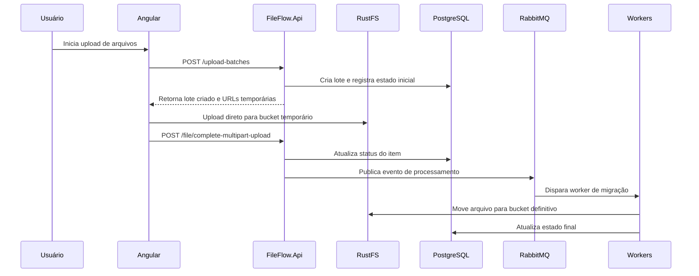
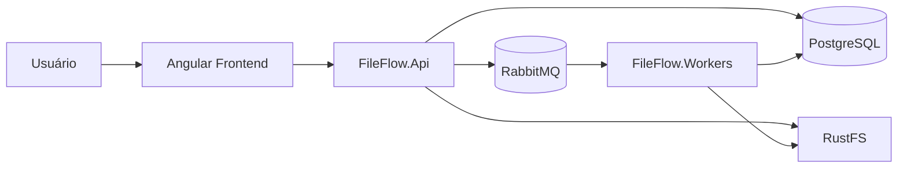
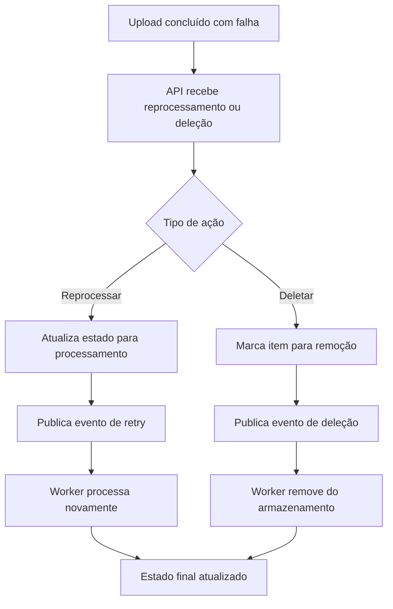

# Arquitetura Técnica — FileFlow

## 1. Resumo Executivo

O FileFlow foi concebido como uma solução para gerenciar uploads assíncronos de arquivos de mídia com foco em experiência do usuário, rastreabilidade e escalabilidade incremental. A arquitetura prioriza simplicidade para desenvolvimento local, desacoplamento entre componentes e capacidade de processar operações em background sem bloquear a interface.

A proposta atual equilibra uma estrutura de backend em .NET, frontend em Angular, armazenamento em RustFS e mensageria com RabbitMQ, mantendo a solução acessível para um projeto de portfólio e, ao mesmo tempo, preparada para evoluir.

## 2. Visão do Tech Lead

A arquitetura do FileFlow foi pensada para equilibrar simplicidade, rastreabilidade e escalabilidade. A ideia central é separar claramente as responsabilidades entre interface, API, processamento assíncrono, armazenamento e observabilidade, mantendo o ambiente local simples e fácil de executar.

## 3. Premissas do Projeto

- O sistema deve suportar uploads assíncronos sem travar a interface do usuário.
- O fluxo deve ser resiliente a falhas e permitir reprocessamento pontual.
- A execução local deve permanecer simples, com poucos componentes externos para subir.
- A arquitetura deve ser evolutiva, sem criar complexidade desnecessária no início.

## 4. Principais Escolhas de Arquitetura

### 3.1 Backend e frontend
- Frontend em Angular para interface do usuário.
- API em ASP.NET Core para entrada HTTP, validação e orquestração inicial.
- Workers .NET para processamento em background.

### 3.2 Armazenamento
- RustFS como armazenamento de objetos compatível com S3.
- Uso de buckets temporários e definitivos para separar o fluxo de upload da migração final.

### 3.3 Mensageria
- RabbitMQ como broker para desacoplar os serviços.
- Eventos para orquestrar etapas como pré-registro, confirmação de upload, migração, falha, reprocessamento e deleção.

### 3.4 Persistência
- PostgreSQL como banco principal para manter o estado dos uploads, os metadados dos arquivos e os eventos de processamento.
- A estrutura de dados é pensada para funcionar como uma máquina de estados para cada arquivo.

### 3.5 Orquestração local
- .NET Aspire como ponto central para rodar dependências locais e simplificar a execução do ambiente.

## 5. Componentes do Sistema

| Componente | Responsabilidade |
| --- | --- |
| Frontend Angular | Interface para upload, acompanhamento e interação do usuário |
| FileFlow.Api | Recebe requisições, prepara uploads, confirma o upload e publica eventos |
| FileFlow.Application | Centraliza lógica de aplicação e orquestração de comandos e consultas |
| FileFlow.Workers | Processa migração, limpeza, reprocessamento e outros fluxos assíncronos |
| FileFlow.MigrationService | Executa a parte de migração e integração com armazenamento |
| FileFlow.Shared | Contratos, DTOs e eventos compartilhados |
| PostgreSQL | Persistência de estado, metadados e eventos |
| RabbitMQ | Mensageria e fila de eventos |
| RustFS | Armazenamento de objetos temporário e definitivo |

### 5.1 Diagrama de Alto Nível

```text
Usuário -> Angular -> FileFlow.Api -> PostgreSQL
                 |                 |
                 |                 v
                 |            RabbitMQ / Eventos
                 |                 |
                 v             FileFlow.Workers
              RustFS (temporário/definitivo)
```

Esse diagrama resume o fluxo principal: o usuário interage com o frontend, a API recebe e orquestra, o processamento assíncrono é disparado via mensageria e o armazenamento é utilizado tanto para upload temporário quanto para migração definitiva.

### 5.2 Fluxo de Upload em Mermaid



### 5.3 Diagrama de Componentes em Mermaid



### 5.4 Fluxo Completo de Reprocessamento e Deleção



## 6. Fluxo Principal do Sistema

1. O usuário inicia o upload de um lote de arquivos.
2. A API cria o pré-registro do arquivo e responde rapidamente ao cliente.
3. O frontend faz o upload direto para o bucket temporário.
4. A API confirma o upload e publica um evento de processamento.
5. Workers consomem o evento e executam a migração para o armazenamento definitivo.
6. O status do arquivo é atualizado ao longo do fluxo.
7. Em caso de erro, o sistema pode reprocessar o arquivo sem recomeçar o lote inteiro.

## 7. Persistência e Modelo de Domínio

A persistência do projeto é pensada para dar suporte ao fluxo de upload, rastreio do lote e acompanhamento do processamento. O foco aqui é o comportamento do sistema e a relação entre os principais conceitos, e não uma especificação detalhada de colunas ou estados.

- UploadBatch: representa o lote de arquivos enviado pelo usuário e o contexto de processamento associado.
- MediaAsset: representa cada arquivo individual dentro do fluxo.
- ProcessingEvent: registra eventos importantes do ciclo de vida do processamento para auditoria e rastreabilidade.

Em documentos de arquitetura mais curtos e práticos, é preferível descrever a intenção desses conceitos do que listar campos detalhados de tabela.

## 8. Documentação Leve da API

A API do FileFlow é implementada com minimal API no projeto FileFlow.Api e expõe os principais endpoints para criação, acompanhamento e reprocessamento de uploads.

### Endpoints principais

- GET /upload-batches: lista os lotes de upload disponíveis.
- GET /upload-batches/{id}: recupera um lote específico.
- GET /upload-batches/{id}/status: retorna o status atual do lote.
- POST /upload-batches/{id}/reprocess: inicia o reprocessamento de um lote.
- POST /upload-batches: cria um novo lote de upload.
- POST /file/generate-upload-url: gera uma URL temporária para upload direto.
- POST /file/complete-multipart-upload: finaliza um upload multipart.
- DELETE /file/cancel-multipart-upload/{objectKey}/{uploadId}: cancela a operação multipart.

### Observações

- Os endpoints são pensados para manter a API simples e orientada ao fluxo de upload assíncrono.
- A camada de aplicação é responsável por organizar a lógica de negócio, enquanto a API atua principalmente como ponto de entrada HTTP.

## 9. Estratégia de Processamento Assíncrono

A arquitetura usa eventos para separar a entrada do usuário das etapas de processamento. Isso traz benefícios como:

- resposta rápida para o frontend;
- desacoplamento entre serviços;
- isolamento de falhas por arquivo;
- possibilidade de reprocessamento pontual;
- maior resiliência do sistema.

## 10. Reprocessamento e Gestão de Falhas

Em caso de falha, o sistema deve:

1. registrar o erro;
2. atualizar o estado do fluxo;
3. permitir uma nova tentativa por demanda;
4. evitar duplicidade de processamento quando o item já estiver concluído.

Esse comportamento é essencial para manter o lote íntegro mesmo quando um arquivo específico não tenha sido processado corretamente.

## 11. Estrutura de Projetos

No repositório atual, a organização dos projetos segue a lógica abaixo:

- FileFlow.Api — ponto de entrada HTTP e fluxo inicial do upload.
- FileFlow.Application — comandos, consultas e lógica de aplicação.
- FileFlow.Workers — execução de background e processamento assíncrono.
- FileFlow.MigrationService — tarefas específicas de migração e integração com armazenamento.
- FileFlow.Shared — contratos, eventos e modelos compartilhados.
- FileFlow.AppHost — orquestração local com Aspire.
- frontend — aplicação Angular.

## 12. Decisões Arquiteturais Relevantes

- PostgreSQL para persistência relacional e rastreabilidade.
- RabbitMQ para desacoplar fluxos assíncronos.
- RustFS para compatibilidade com armazenamento em object storage.
- ASP.NET Core minimal API como camada de entrada HTTP.
- .NET Aspire para reduzir a complexidade de execução local.

## 13. Riscos e Trade-offs

A arquitetura proposta oferece simplicidade e boa evolução incremental, mas apresenta alguns trade-offs naturais:

- O uso de múltiplos componentes aumenta a complexidade operacional local em comparação com uma solução monolítica.
- A separação em API, workers e mensageria exige disciplina de integração entre os serviços.
- A escolha por uma solução de armazenamento compatível com S3 facilita evolução futura, mas exige cuidado na modelagem dos fluxos de migração e limpeza.
- A documentação e a governança do fluxo assíncrono precisam ser mantidas para evitar ambiguidades no entendimento do comportamento do sistema.

## 14. Próximos Passos

Os próximos passos recomendados para a evolução do projeto são:

- consolidar o fluxo completo de reprocessamento e deleção em implementação real;
- padronizar os contratos de eventos entre API e workers;
- expandir a documentação da API com exemplos de requests e responses;
- adicionar observabilidade básica com logs, métricas e health checks;
- revisar a integração com o frontend para refletir o estado de processamento em tempo real.

## 15. Conclusão

A arquitetura do FileFlow foi organizada para ser simples o suficiente para um projeto de portfólio, ao mesmo tempo em que mantém uma base robusta para evoluir para cenários mais complexos no futuro. A separação entre API, workers, mensageria e persistência é o principal pilar dessa estrutura.
